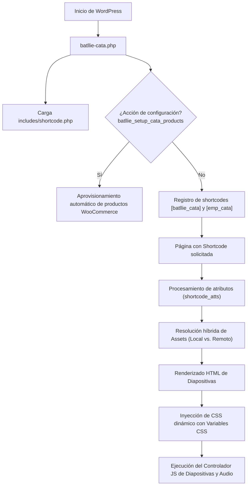

# Arquitectura y Estructura del Plugin

Este documento describe la arquitectura interna, la jerarquía de archivos, el ciclo de vida y los componentes tecnológicos de **Batllié - Ritual de Cata**.

---

## 1. Organización de Directorios

```text
batllie-cata/
├── assets/
│   ├── css/
│   │   └── styles.css              # Hoja de estilos principal (fácil mantenimiento y edición)
│   ├── js/
│   │   └── batllie-cata.js         # Script modular de interactividad y máquina de estados
│   └── images/                     # Recursos gráficos locales de alta resolución
│       ├── box.jpg                 # Imagen general de cajas premium
│       ├── mate-1-cream.png        # Paso 1: El Lecho
│       ├── mate-2-cream.png        # Paso 2: La Base
│       ├── mate-3-cream.png        # Paso 3: El Disfrute
│       ├── limon.jpg               # Alfajor Limón
│       ├── batllie-blanco.jpg       # Alfajor Batllié Blanco
│       ├── batllie-negro.jpg        # Alfajor Batllié Negro
│       ├── chocolate-blanco.jpg     # Alfajor Chocolate Blanco
│       ├── cafe-suizo.jpg          # Alfajor Café Suizo
│       ├── chocolate-intenso.jpg    # Alfajor Chocolate Intenso
│       ├── nuez.jpg                # Alfajor Nuez
│       └── mousse-nutella.jpg      # Alfajor Mousse Nutella
├── docs/                           # Documentación técnica del proyecto
│   ├── README.md                   # Índice general de documentación
│   ├── architecture.md             # Arquitectura y ciclo de vida
│   ├── shortcode-guide.md          # Referencia del shortcode y eventos
│   ├── woocommerce-integration.md  # Catálogo, tablas y productos
│   └── development-guide.md        # Buenas prácticas y entorno local
├── includes/
│   └── shortcode.php               # Motor de renderizado y plantilla HTML limpia (~260 líneas)
├── batllie-cata.php                # Archivo raíz, cabecera de WordPress, enqueue y hooks
├── batllie-logo-transparent.png    # Logotipo oficial Batllié en alta definición
├── README.md                       # Documentación pública para GitHub
└── .gitignore                      # Exclusiones de control de versiones
```

---

## 2. Flujo de Inicialización y Ciclo de Vida

El ciclo de ejecución del plugin dentro del ecosistema de WordPress se estructura de la siguiente manera:



---

## 3. Componentes Arquitectónicos Clave

### A. Motor de Diapositivas (Visual Novel Engine)
- **Aislamiento por UID:** Cada instancia del shortcode genera un identificador único aleatorio (`$uid = 'batllie_cata_' . wp_rand(1000, 9999);`), previniendo colisiones de estilos o scripts si existieran múltiples instancias.
- **Transiciones fluidas:** Utiliza animaciones CSS aceleradas por GPU (`transform: translateY(...)`, `opacity`) para transicionar entre capítulos sensoriales sin saltos bruscos ni recarga de página.
- **Bloqueo de scroll global:** Al activarse la experiencia, añade clases al `<html>` y `<body>` (`has-batllie-cata`) para concentrar toda la interacción dentro del viewport del ritual.

### B. Sistema Híbrido de Resolución de Assets
Para garantizar que el plugin funcione de forma autónoma tanto en servidores en producción como en entornos locales desconectados (XAMPP):
1. **Verificación de archivos locales:** Evalúa primero si la imagen existe físicamente en `assets/images/` del plugin o en `img/cata/` del tema.
2. **Fallback resiliente:** Si un recurso no se encuentra localmente, conmuta de forma transparente hacia la URL en el CDN o servidor multimedia remoto.

### C. Motor de Audio Ambiental y Pausa Consciente
- **Reproducción condicional:** Respeta la preferencia del usuario en la pantalla de bienvenida (checkbox para activar o silenciar audio ambiental).
- **Control flotante:** Botón accesible en la cabecera para pausar o reactivar la pista musical en cualquier momento.
- **Paso condicional de mate:** Si el usuario no desea preparar mate, el motor excluye dinámicamente la diapositiva del mate de la cola de navegación y recalcula la barra de progreso automáticamente.
